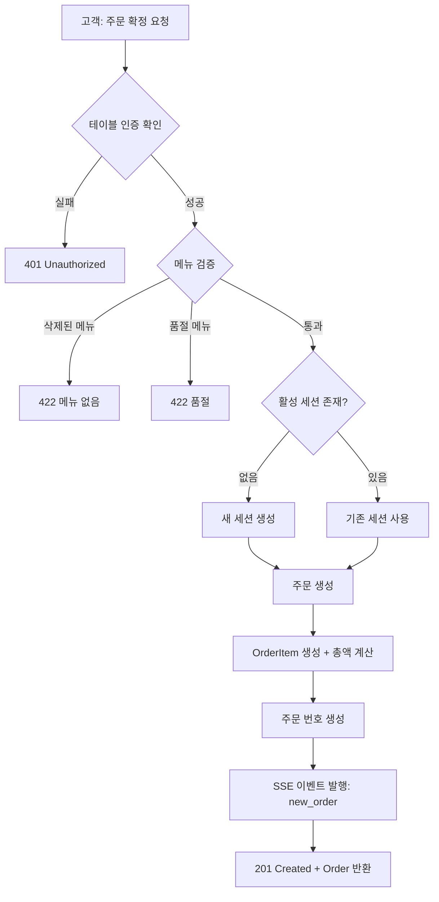
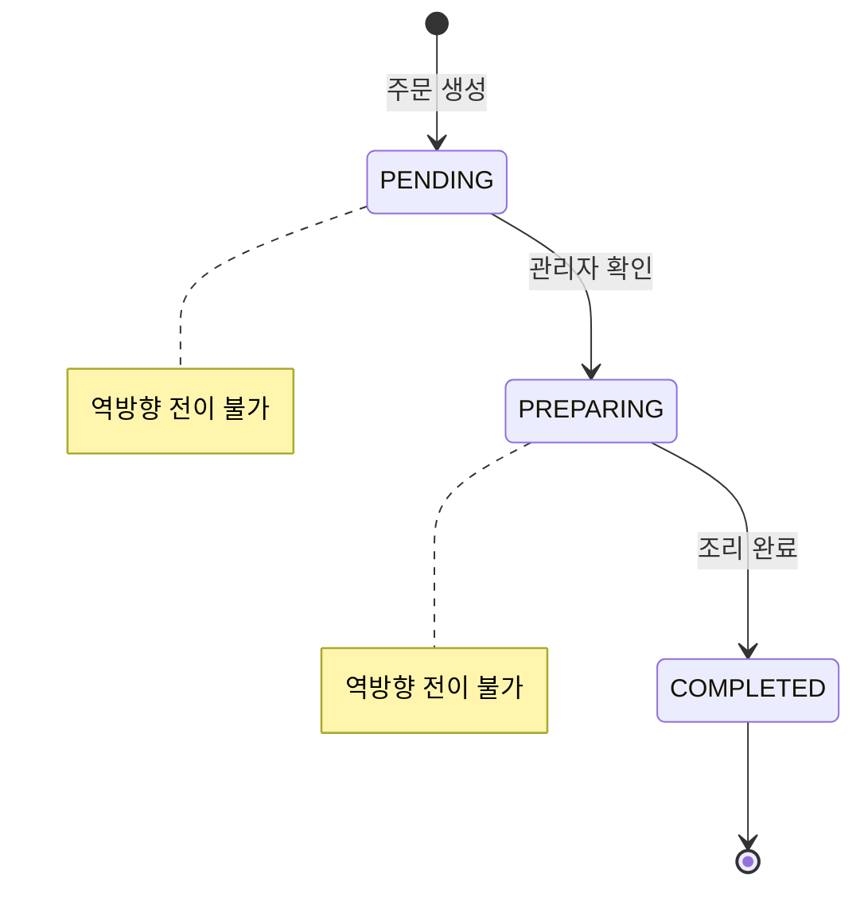
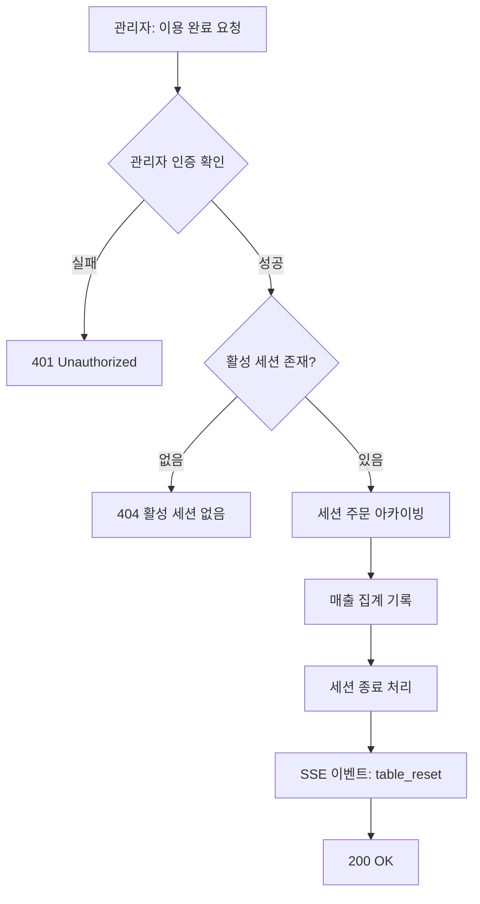
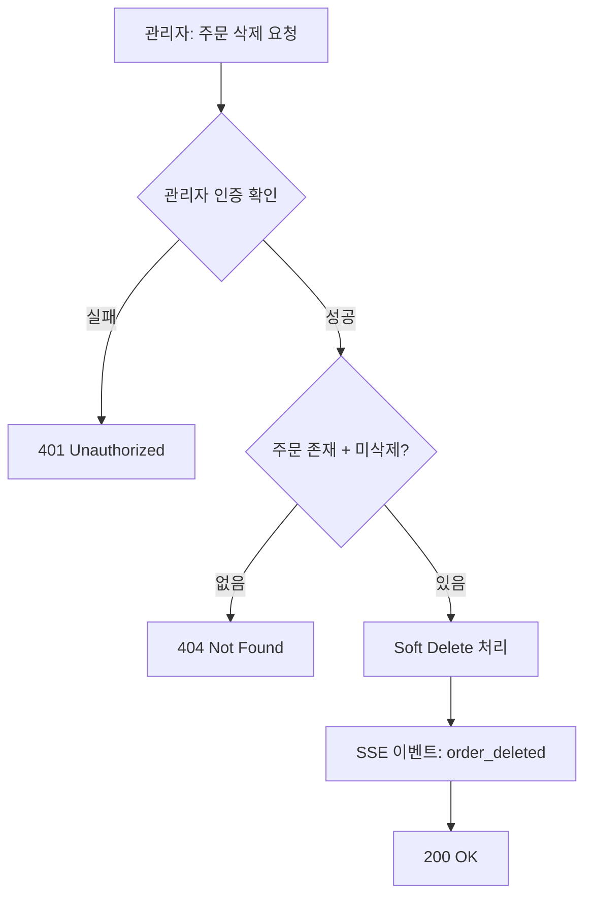
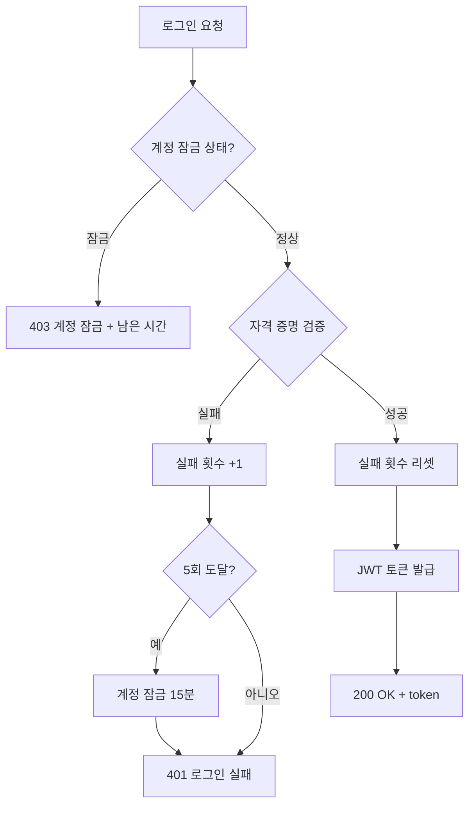
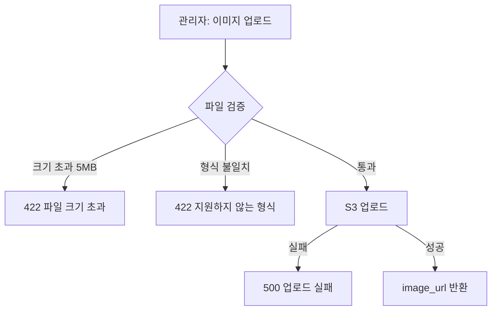
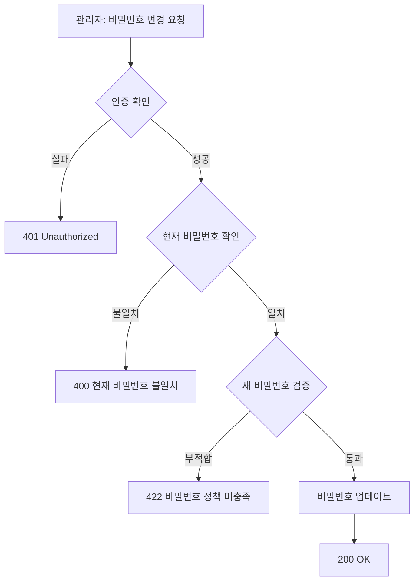

# Business Logic Model — Unit 1 (Backend API)

## 1. 주문 생성 플로우 (Order Creation)



### Text Alternative
```
1. 고객 주문 확정 요청
2. 테이블 인증 확인 → 실패 시 401
3. 메뉴 검증 (삭제/품절 확인) → 실패 시 422
4. 활성 세션 확인 → 없으면 새 세션 생성
5. 주문 생성 + OrderItem 생성 + 총액 계산
6. 주문 번호 생성
7. SSE 이벤트 발행 (new_order)
8. 201 Created 응답
```

### 상세 로직

**메뉴 검증**:
- 요청된 모든 menu_id가 존재하는지 확인
- `is_deleted = true`인 메뉴 → 422 에러 ("해당 메뉴는 더 이상 제공되지 않습니다")
- `is_sold_out = true`인 메뉴 → 422 에러 ("품절된 메뉴가 포함되어 있습니다: {menu_name}")
- 검증은 원자적으로 수행 (일부만 실패해도 전체 주문 거부)

**세션 관리**:
- `TableSession`에서 `table_id`와 `is_active=true` 조건으로 조회
- 없으면 새 세션 생성 (session_token = UUID4)
- 있으면 기존 세션의 session_id 사용

**주문 번호 생성**:
- 형식: `{YYMMDD}-{table_number}-{sequence}`
- sequence: 해당 테이블의 당일 주문 순번 (001부터)
- 예: `260506-03-001`, `260506-03-002`

**총액 계산**:
- `total_amount = SUM(quantity * unit_price)` for all items
- OrderItem.unit_price는 주문 시점의 Menu.price 스냅샷

---

## 2. 주문 상태 변경 플로우 (Order Status Transition)



### Text Alternative
```
PENDING → PREPARING → COMPLETED (단방향만 허용)
```

### 상태 전이 규칙

| 현재 상태 | 허용 전이 | 금지 전이 |
|-----------|-----------|-----------|
| PENDING | → PREPARING | → COMPLETED (건너뛰기 불가) |
| PREPARING | → COMPLETED | → PENDING (역방향 불가) |
| COMPLETED | 없음 (최종 상태) | 모든 전이 불가 |

**전이 실패 시**: 409 Conflict + 에러 메시지 ("PENDING에서 COMPLETED로 직접 변경할 수 없습니다")

**SSE 이벤트**: 상태 변경 성공 시 `order_status_changed` 이벤트 발행
- 관리자 채널: 전체 브로드캐스트
- 고객 채널: 해당 테이블에만 전송

---

## 3. 테이블 이용 완료 플로우 (Table Session Complete)



### Text Alternative
```
1. 관리자 인증 확인 → 실패 시 401
2. 활성 세션 확인 → 없으면 404
3. 해당 세션의 모든 주문 아카이빙 (is_archived=true, archived_at=now)
4. SessionRevenue 테이블에 매출 집계 기록
5. 세션 종료 (is_active=false, ended_at=now)
6. SSE 이벤트 발행 (table_reset)
7. 200 OK 응답
```

### 매출 집계 로직

```python
# 세션 종료 시 집계
total_revenue = SUM(order.total_amount) 
    WHERE session_id = current_session 
    AND is_deleted = false

order_count = COUNT(orders) 
    WHERE session_id = current_session 
    AND is_deleted = false

# SessionRevenue 레코드 생성
SessionRevenue(
    store_id=table.store_id,
    table_id=table.id,
    session_id=session.id,
    total_revenue=total_revenue,
    order_count=order_count,
    session_started_at=session.started_at,
    session_ended_at=now()
)
```

---

## 4. 주문 삭제 플로우 (Order Soft Delete)



### Text Alternative
```
1. 관리자 인증 확인
2. 주문 존재 여부 확인 (is_deleted=false)
3. Soft Delete (is_deleted=true, deleted_at=now)
4. SSE 이벤트 발행 (order_deleted)
5. 200 OK
```

### 삭제 후 처리
- 해당 테이블의 현재 세션 총 주문액 재계산은 프론트에서 처리 (SSE 이벤트 수신 후 대시보드 갱신)
- 삭제된 주문은 고객 주문 내역에서도 제외

---

## 5. SSE 이벤트 시스템

### 채널 구조

| 채널 | 구독자 | 이벤트 |
|------|--------|--------|
| `admin` | 관리자 (전체) | new_order, order_status_changed, order_deleted, table_reset |
| `table:{table_id}` | 해당 테이블 고객 | order_status_changed |

### 이벤트 페이로드

```json
// new_order
{
  "event": "new_order",
  "data": {
    "order_id": 1,
    "order_number": "260506-03-001",
    "table_id": 3,
    "table_number": 3,
    "status": "PENDING",
    "total_amount": 25000,
    "created_at": "2026-05-06T12:30:00Z"
  }
}

// order_status_changed
{
  "event": "order_status_changed",
  "data": {
    "order_id": 1,
    "order_number": "260506-03-001",
    "table_id": 3,
    "status": "PREPARING",
    "total_amount": 25000,
    "updated_at": "2026-05-06T12:32:00Z"
  }
}

// order_deleted
{
  "event": "order_deleted",
  "data": {
    "order_id": 1,
    "order_number": "260506-03-001",
    "table_id": 3,
    "total_amount": 25000
  }
}

// table_reset
{
  "event": "table_reset",
  "data": {
    "table_id": 3,
    "table_number": 3
  }
}
```

### 연결 관리

- **관리자**: JWT 토큰으로 인증 후 SSE 연결
- **고객**: table_token으로 인증 후 자기 테이블 채널만 구독
- **Heartbeat**: 30초마다 `:ping` 전송 (연결 유지)
- **재연결**: 클라이언트 `Last-Event-ID` 헤더로 이벤트 재전송 지원
- **타임아웃**: 연결 후 16시간 경과 시 서버에서 연결 종료

---

## 6. 인증/인가 플로우

### 관리자 로그인



### Text Alternative
```
1. 계정 잠금 상태 확인 → 잠금이면 403
2. store_code + username + password 검증
3. 실패 시: 실패 횟수 +1, 5회 도달 시 15분 잠금
4. 성공 시: 실패 횟수 리셋, JWT 발급 (16시간 만료)
```

### JWT 토큰 구조

```json
// 관리자 토큰
{
  "sub": "admin:1",
  "store_id": 1,
  "role": "admin",
  "exp": 1746576000,  // 16시간 후
  "iat": 1746518400
}

// 테이블 토큰
{
  "sub": "table:3",
  "store_id": 1,
  "table_id": 3,
  "table_number": 3,
  "role": "customer",
  "exp": null  // 만료 없음 (세션 기반 관리)
}
```

---

## 7. 이미지 업로드 플로우



### Text Alternative
```
1. 파일 검증: 크기(5MB), 형식(JPEG/PNG/WebP), MIME 타입 확인
2. S3 업로드: bucket/{store_id}/menus/{uuid}.{ext}
3. 성공 시 S3 URL 반환
```

### S3 키 구조
```
{bucket}/
  {store_id}/
    menus/
      {uuid}.jpg
      {uuid}.png
      {uuid}.webp
```

---

## 8. 메뉴 순서 일괄 업데이트 플로우

### 요청 형식
```json
PUT /api/categories/{category_id}/menu-order
{
  "menu_ids": [5, 3, 1, 4, 2]  // 원하는 순서대로 menu_id 배열
}
```

### 처리 로직
```python
# 검증
1. 모든 menu_id가 해당 category_id에 속하는지 확인
2. 누락된 메뉴가 없는지 확인 (활성 메뉴 전체 포함 필수)

# 업데이트
for index, menu_id in enumerate(menu_ids):
    menu.sort_order = index  # 0부터 순서 부여

# 응답: 200 OK + 정렬된 메뉴 목록
```

---

## 9. Soft Delete 자동 정리 배치

### 스케줄
- **실행 시간**: 매일 02:00 (KST)
- **대상**: `is_deleted=true AND deleted_at < NOW() - 90 days`

### 처리 순서
```python
# 1. 삭제 대상 Order 조회
expired_orders = Order.filter(
    is_deleted=True,
    deleted_at__lt=now() - timedelta(days=90)
)

# 2. 관련 OrderItem Hard Delete (CASCADE)
OrderItem.filter(order_id__in=expired_order_ids).delete()

# 3. Order Hard Delete
expired_orders.delete()

# 4. 삭제된 Menu 정리 (SET NULL ON DELETE로 FK 안전)
expired_menus = Menu.filter(
    is_deleted=True,
    deleted_at__lt=now() - timedelta(days=90)
)
# OrderItem.menu_id는 자동으로 NULL 설정됨 (SET NULL ON DELETE)
# menu_name/unit_price 스냅샷은 보존되므로 데이터 손실 없음
expired_menus.delete()
```

---

## 10. 비밀번호 변경 플로우



### Text Alternative
```
1. 관리자 인증 확인
2. 현재 비밀번호 검증
3. 새 비밀번호 정책 확인 (최소 8자, 영문+숫자)
4. bcrypt 해시 후 저장
```
