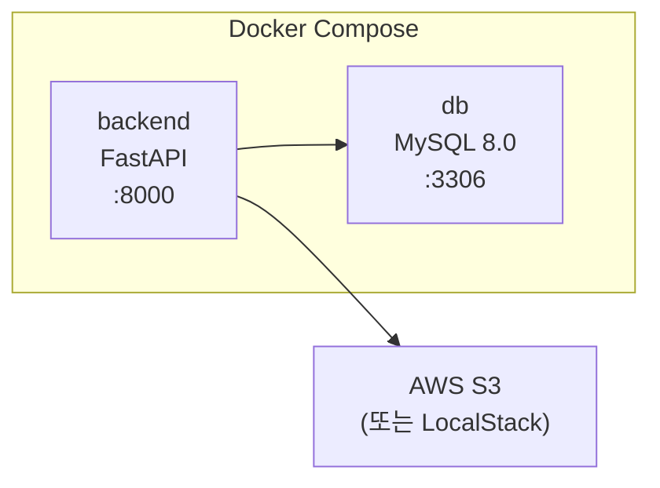
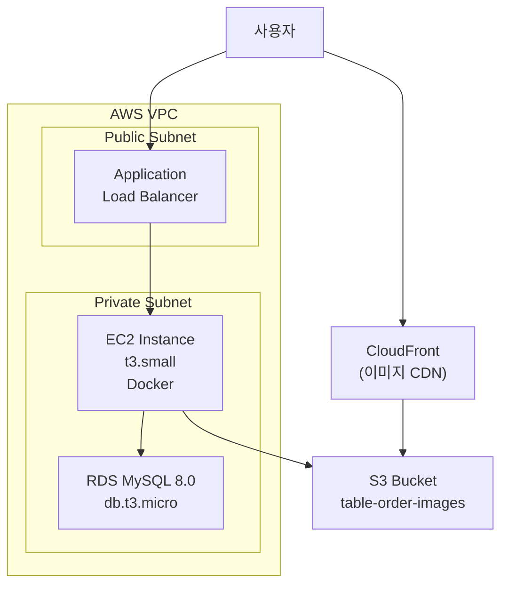

# Infrastructure Design — Unit 1 (Backend API)

## 인프라 개요

| 환경 | 구성 | 용도 |
|------|------|------|
| **로컬 개발** | Docker Compose (backend + MySQL) | 개발/테스트 |
| **프로덕션** | AWS (EC2 + RDS + S3) | 실제 서비스 |

---

## 1. 로컬 개발 환경 (Docker Compose)

### 아키텍처



### Text Alternative
```
Docker Compose:
  - backend (FastAPI, port 8000) → db (MySQL 8.0, port 3306)
  - backend → AWS S3 (외부)
```

### docker-compose.yml

```yaml
version: "3.8"

services:
  backend:
    build:
      context: ./backend
      dockerfile: Dockerfile
    ports:
      - "8000:8000"
    environment:
      - APP_ENV=development
      - DB_HOST=db
      - DB_PORT=3306
      - DB_NAME=table_order
      - DB_USER=root
      - DB_PASSWORD=devpassword
    depends_on:
      db:
        condition: service_healthy
    volumes:
      - ./backend/app:/app/app  # 핫 리로드용
    healthcheck:
      test: ["CMD", "curl", "-f", "http://localhost:8000/health"]
      interval: 30s
      timeout: 10s
      retries: 3
      start_period: 10s

  db:
    image: mysql:8.0
    ports:
      - "3306:3306"
    environment:
      MYSQL_ROOT_PASSWORD: devpassword
      MYSQL_DATABASE: table_order
      MYSQL_CHARSET: utf8mb4
      MYSQL_COLLATION: utf8mb4_unicode_ci
    volumes:
      - mysql_data:/var/lib/mysql
      - ./backend/scripts/init.sql:/docker-entrypoint-initdb.d/init.sql
    healthcheck:
      test: ["CMD", "mysqladmin", "ping", "-h", "localhost"]
      interval: 10s
      timeout: 5s
      retries: 5
    command: --character-set-server=utf8mb4 --collation-server=utf8mb4_unicode_ci

volumes:
  mysql_data:
```

### Dockerfile (Backend)

```dockerfile
FROM python:3.11-slim

WORKDIR /app

# 시스템 의존성
RUN apt-get update && apt-get install -y --no-install-recommends \
    curl \
    && rm -rf /var/lib/apt/lists/*

# Python 의존성
COPY requirements.txt .
RUN pip install --no-cache-dir -r requirements.txt

# 애플리케이션 코드
COPY . .

# 포트 노출
EXPOSE 8000

# 개발: uvicorn 핫 리로드
CMD ["uvicorn", "app.main:app", "--host", "0.0.0.0", "--port", "8000", "--reload"]
```

### Dockerfile.prod (프로덕션)

```dockerfile
FROM python:3.11-slim

WORKDIR /app

RUN apt-get update && apt-get install -y --no-install-recommends \
    curl \
    && rm -rf /var/lib/apt/lists/*

COPY requirements.txt .
RUN pip install --no-cache-dir -r requirements.txt

COPY . .

EXPOSE 8000

# 프로덕션: gunicorn + uvicorn workers
CMD ["gunicorn", "app.main:app", "-w", "2", "-k", "uvicorn.workers.UvicornWorker", "--bind", "0.0.0.0:8000"]
```

---

## 2. 프로덕션 환경 (AWS)

### 아키텍처



### Text Alternative
```
사용자 → ALB (Public) → EC2 (Private, Docker) → RDS MySQL (Private)
사용자 → CloudFront → S3 (이미지)
EC2 → S3 (업로드)
```

### AWS 서비스 매핑

| 논리 컴포넌트 | AWS 서비스 | 사양 | 월 예상 비용 |
|--------------|-----------|------|-------------|
| 애플리케이션 서버 | EC2 t3.small | 2 vCPU, 2GB RAM | ~$15 |
| 데이터베이스 | RDS MySQL db.t3.micro | 1 vCPU, 1GB RAM, 20GB | ~$15 |
| 이미지 저장소 | S3 Standard | 무제한 | ~$1 (소규모) |
| 이미지 CDN | CloudFront | 글로벌 엣지 | ~$1 (소규모) |
| 로드밸런서 | ALB | HTTPS 종단 | ~$16 |
| **합계** | | | **~$48/월** |

---

## 3. 네트워크 설계

### 보안 그룹 (Security Groups)

| 이름 | 인바운드 | 아웃바운드 | 대상 |
|------|----------|-----------|------|
| sg-alb | 80, 443 (0.0.0.0/0) | All | ALB |
| sg-backend | 8000 (sg-alb만) | All | EC2 |
| sg-db | 3306 (sg-backend만) | None | RDS |

### HTTPS 설정
- ACM (AWS Certificate Manager)에서 SSL 인증서 발급
- ALB에서 HTTPS 종단 (443 → 8000 HTTP)
- HTTP → HTTPS 리다이렉트

---

## 4. S3 설정

### 버킷 구성

| 항목 | 설정 |
|------|------|
| 버킷명 | `table-order-images-{env}` |
| 리전 | ap-northeast-2 (서울) |
| 접근 제어 | Private (퍼블릭 접근 차단) |
| 이미지 서빙 | CloudFront OAI (Origin Access Identity) |
| 수명 주기 | 없음 (영구 보관) |

### IAM 정책 (EC2 → S3)

```json
{
  "Version": "2012-10-17",
  "Statement": [
    {
      "Effect": "Allow",
      "Action": [
        "s3:PutObject",
        "s3:GetObject",
        "s3:DeleteObject"
      ],
      "Resource": "arn:aws:s3:::table-order-images-*/*"
    },
    {
      "Effect": "Allow",
      "Action": "s3:ListBucket",
      "Resource": "arn:aws:s3:::table-order-images-*"
    }
  ]
}
```

---

## 5. 데이터베이스 설정

### RDS 구성

| 항목 | 설정 |
|------|------|
| 엔진 | MySQL 8.0 |
| 인스턴스 | db.t3.micro (프리 티어) |
| 스토리지 | 20GB gp3 (자동 확장 활성) |
| 백업 | 자동 백업 7일 보존 |
| 멀티 AZ | 비활성 (MVP, 비용 절감) |
| 파라미터 | character_set_server=utf8mb4, time_zone=Asia/Seoul |

### 로컬 개발 DB 초기화 스크립트 (init.sql)

```sql
-- 기본 매장 + 관리자 시드 데이터
CREATE DATABASE IF NOT EXISTS table_order
  CHARACTER SET utf8mb4
  COLLATE utf8mb4_unicode_ci;

USE table_order;

-- Alembic이 스키마 생성하므로 여기서는 시드 데이터만
-- (마이그레이션 실행 후 seed 스크립트로 분리)
```

---

## 6. 배포 전략

### 개발 워크플로우

```
1. 로컬 개발: docker-compose up → 코드 수정 → 핫 리로드
2. 테스트: docker-compose run backend pytest
3. 빌드: docker build -f Dockerfile.prod -t table-order-backend .
4. 배포: EC2에 docker pull → docker-compose -f docker-compose.prod.yml up -d
```

### 프로덕션 배포 (수동, MVP)

```bash
# EC2 접속
ssh ec2-user@{instance-ip}

# 최신 이미지 pull (Docker Hub 또는 ECR)
docker pull {registry}/table-order-backend:latest

# 서비스 재시작
docker-compose -f docker-compose.prod.yml up -d --force-recreate backend
```

### 향후 CI/CD (GitHub Actions)
```
Push to main → Build → Test → Push to ECR → Deploy to EC2
```

---

## 7. 환경별 설정 분리

| 설정 | 개발 (.env.development) | 프로덕션 (.env.production) |
|------|------------------------|--------------------------|
| APP_ENV | development | production |
| APP_DEBUG | true | false |
| DB_HOST | db (Docker) | {rds-endpoint} |
| DB_PASSWORD | devpassword | {Secrets Manager} |
| JWT_SECRET | dev-secret | {Secrets Manager} |
| CORS_ORIGINS | http://localhost:* | https://app.example.com |
| S3_BUCKET | table-order-images-dev | table-order-images-prod |

---

## 8. 백업 및 복구

| 대상 | 전략 | 주기 | 보존 |
|------|------|------|------|
| RDS | 자동 스냅샷 | 매일 | 7일 |
| S3 이미지 | 버전 관리 활성 | 실시간 | 영구 |
| 애플리케이션 코드 | Git (GitHub) | 커밋마다 | 영구 |
| 환경 설정 | .env.example (Git) + Secrets Manager | 변경 시 | 영구 |
