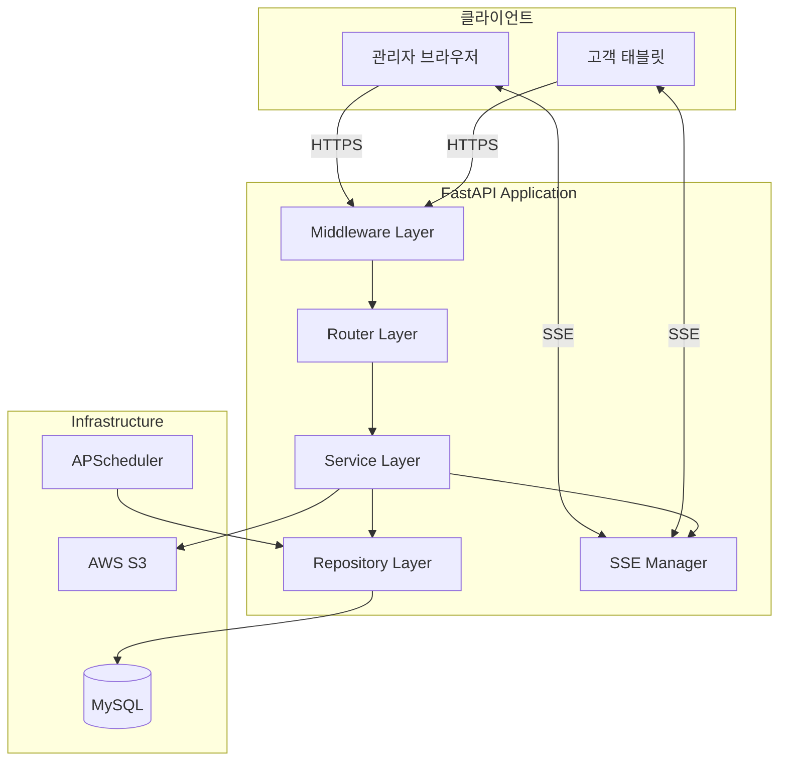

# Logical Components — Unit 1 (Backend API)

## 컴포넌트 아키텍처 개요



### Text Alternative
```
Client Layer: 관리자 브라우저, 고객 태블릿
  ↓ HTTPS / SSE
Middleware Layer: CORS, Rate Limiting, Request ID, Auth
  ↓
Router Layer: Auth, Orders, Menus, Tables 라우터
  ↓
Service Layer: 비즈니스 로직 (AuthService, OrderService, MenuService, TableService)
  ↓
Repository Layer: DB 접근 (SQLAlchemy async)
  ↓
Infrastructure: MySQL, AWS S3, APScheduler
```

---

## 1. Middleware Layer (미들웨어 계층)

### 구성 요소

| 미들웨어 | 순서 | 역할 |
|----------|------|------|
| CORSMiddleware | 1 | Cross-Origin 요청 허용/차단 |
| RequestIDMiddleware | 2 | 요청별 고유 ID 생성 + 로깅 바인딩 |
| RateLimitMiddleware | 3 | slowapi 기반 요청 제한 |
| LoggingMiddleware | 4 | 요청/응답 로깅 (시간, 상태 코드) |

### 실행 순서
```
Request → CORS → RequestID → RateLimit → Logging → Router → Response
```

### 설정

```python
# main.py 미들웨어 등록 순서
app.add_middleware(
    CORSMiddleware,
    allow_origins=settings.cors_origins,
    allow_credentials=True,
    allow_methods=["*"],
    allow_headers=["*"],
)
app.add_middleware(RequestIDMiddleware)
# slowapi는 app.state에 등록
app.state.limiter = limiter
app.add_exception_handler(RateLimitExceeded, _rate_limit_exceeded_handler)
```

---

## 2. Router Layer (라우터 계층)

### 라우터 등록

| Prefix | 라우터 | 인증 요구 |
|--------|--------|-----------|
| `/api/auth` | auth.router | 없음 (로그인 엔드포인트) |
| `/api/orders` | orders.router | 테이블 또는 관리자 |
| `/api/categories` | menus.router (categories) | 조회: 없음, 변경: 관리자 |
| `/api/menus` | menus.router (menus) | 조회: 없음, 변경: 관리자 |
| `/api/tables` | tables.router | 관리자 |
| `/health` | core.router | 없음 |

### 의존성 주입 체인

```python
# 공통 의존성
get_db() → AsyncSession
get_current_user() → UserInfo (JWT 검증)
get_current_admin() → UserInfo (관리자 권한 확인)
get_current_table() → TableInfo (테이블 권한 확인)
get_pagination() → PaginationParams
```

---

## 3. Service Layer (서비스 계층)

### 서비스 구성

| 서비스 | 의존성 | 핵심 책임 |
|--------|--------|-----------|
| AuthService | AdminRepo, TableRepo, JWTUtil | 인증/인가, 토큰 관리, 로그인 제한 |
| OrderService | OrderRepo, SessionRepo, SSEManager | 주문 CRUD, 상태 전이, SSE 발행 |
| MenuService | MenuRepo, CategoryRepo, S3Client | 메뉴/카테고리 CRUD, 이미지 업로드 |
| TableService | TableRepo, SessionRepo, OrderRepo, SSEManager | 테이블 설정, 세션 관리, 이용 완료 |

### 서비스 인스턴스 관리

```python
# 패턴: FastAPI Dependency Injection
def get_order_service(
    db: AsyncSession = Depends(get_db),
    sse: SSEManager = Depends(get_sse_manager),
) -> OrderService:
    return OrderService(
        order_repo=OrderRepository(db),
        session_repo=SessionRepository(db),
        sse_manager=sse,
    )
```

---

## 4. Repository Layer (리포지토리 계층)

### 리포지토리 구성

| 리포지토리 | 엔티티 | 주요 메서드 |
|-----------|--------|------------|
| AdminRepository | Admin, Store | find_by_credentials, update_login_attempts |
| TableRepository | TableEntity | find_by_store_and_number, create, update |
| SessionRepository | TableSession | find_active, create, close |
| OrderRepository | Order, OrderItem | create, find_by_session, update_status, archive |
| MenuRepository | Menu | find_by_category, create, update, soft_delete |
| CategoryRepository | Category | find_all, create, update, delete |
| RevenueRepository | SessionRevenue | create, find_by_date_range |

### 공통 패턴

```python
# 베이스 리포지토리
class BaseRepository(Generic[T]):
    def __init__(self, db: AsyncSession, model: type[T]):
        self.db = db
        self.model = model

    async def get_by_id(self, id: int) -> T | None:
        return await self.db.get(self.model, id)

    async def create(self, **kwargs) -> T:
        instance = self.model(**kwargs)
        self.db.add(instance)
        await self.db.flush()
        return instance
```

---

## 5. SSE Manager (실시간 이벤트 관리)

### 구조

```python
class SSEManager:
    """인메모리 SSE 연결 관리자 (싱글톤)"""

    # 채널 구조
    _admin_clients: dict[str, asyncio.Queue]    # client_id → queue
    _table_clients: dict[int, asyncio.Queue]    # table_id → queue
    _event_counter: int                          # Last-Event-ID 지원
```

### 생명주기

```
1. 클라이언트 연결 → subscribe(client_id/table_id)
2. Queue 생성 → 클라이언트 목록에 등록
3. 이벤트 발생 → broadcast/notify → Queue에 push
4. 클라이언트 수신 → Queue에서 pop → SSE 전송
5. 연결 종료 → finally 블록에서 클라이언트 제거
```

### 싱글톤 관리

```python
# app 시작 시 생성, lifespan으로 관리
@asynccontextmanager
async def lifespan(app: FastAPI):
    app.state.sse_manager = SSEManager()
    yield
    # 종료 시 모든 연결 정리
    await app.state.sse_manager.shutdown()

def get_sse_manager(request: Request) -> SSEManager:
    return request.app.state.sse_manager
```

---

## 6. Scheduler (배치 작업 관리)

### 구성

| 작업 | 스케줄 | 역할 |
|------|--------|------|
| cleanup_deleted_orders | 매일 02:00 KST | 90일 지난 Soft Delete 주문 Hard Delete |
| cleanup_deleted_menus | 매일 02:10 KST | 90일 지난 Soft Delete 메뉴 Hard Delete |
| heartbeat_check | 매 30초 | SSE 죽은 연결 정리 |

### 구현

```python
# APScheduler 설정
from apscheduler.schedulers.asyncio import AsyncIOScheduler

scheduler = AsyncIOScheduler(timezone="Asia/Seoul")

@asynccontextmanager
async def lifespan(app: FastAPI):
    app.state.sse_manager = SSEManager()
    scheduler.add_job(cleanup_deleted_orders, "cron", hour=2, minute=0)
    scheduler.add_job(cleanup_deleted_menus, "cron", hour=2, minute=10)
    scheduler.start()
    yield
    scheduler.shutdown()
```

---

## 7. S3 Client (이미지 저장소)

### 구성

```python
class S3Client:
    """AWS S3 이미지 업로드/삭제 래퍼"""

    def __init__(self, settings: Settings):
        self.bucket = settings.s3_bucket_name
        self.client = boto3.client(
            "s3",
            region_name=settings.aws_region,
            aws_access_key_id=settings.aws_access_key_id,
            aws_secret_access_key=settings.aws_secret_access_key,
        )

    async def upload(self, file: UploadFile, store_id: int) -> str:
        """파일 업로드 → S3 URL 반환"""
        ext = file.filename.split(".")[-1]
        key = f"{store_id}/menus/{uuid4()}.{ext}"
        await asyncio.to_thread(
            self.client.upload_fileobj, file.file, self.bucket, key
        )
        return f"https://{self.bucket}.s3.amazonaws.com/{key}"

    async def delete(self, url: str):
        """기존 이미지 삭제"""
        key = url.split(".amazonaws.com/")[1]
        await asyncio.to_thread(
            self.client.delete_object, Bucket=self.bucket, Key=key
        )
```

---

## 8. Database Session 관리

### 세션 팩토리

```python
from sqlalchemy.ext.asyncio import create_async_engine, async_sessionmaker

engine = create_async_engine(settings.database_url, **pool_config)
AsyncSessionLocal = async_sessionmaker(engine, expire_on_commit=False)

async def get_db() -> AsyncGenerator[AsyncSession, None]:
    async with AsyncSessionLocal() as session:
        try:
            yield session
            await session.commit()
        except Exception:
            await session.rollback()
            raise
```

### 트랜잭션 전략

| 시나리오 | 전략 |
|----------|------|
| 단순 조회 | 자동 commit (get_db 기본) |
| 단일 생성/수정 | 자동 commit |
| 복합 작업 (이용 완료) | 명시적 `async with db.begin()` |
| 읽기 전용 | `execution_options(readonly=True)` |

---

## 9. 컴포넌트 간 의존성 맵

```
main.py
├── Middleware (CORS, RequestID, RateLimit, Logging)
├── Lifespan (SSEManager, Scheduler 초기화)
├── Routers
│   ├── auth.router → AuthService → AdminRepo, TableRepo
│   ├── orders.router → OrderService → OrderRepo, SessionRepo, SSEManager
│   ├── menus.router → MenuService → MenuRepo, CategoryRepo, S3Client
│   └── tables.router → TableService → TableRepo, SessionRepo, OrderRepo, SSEManager
├── Core
│   ├── config.py (Settings)
│   ├── database.py (Engine, Session)
│   ├── security.py (JWT, bcrypt)
│   ├── dependencies.py (get_db, get_current_user)
│   ├── exceptions.py (AppException hierarchy)
│   ├── logging.py (structlog config)
│   └── s3.py (S3Client)
└── Scheduler (cleanup jobs)
```
