# Execution Plan

## Detailed Analysis Summary

### Change Impact Assessment
- **User-facing changes**: Yes — 고객 주문 UI + 관리자 대시보드 전체 신규 개발
- **Structural changes**: Yes — 프론트엔드/백엔드 분리 아키텍처 신규 구성
- **Data model changes**: Yes — 8개 엔티티 신규 설계 (Store, Admin, Table, TableSession, Category, Menu, Order, OrderItem)
- **API changes**: Yes — RESTful API 전체 신규 설계
- **NFR impact**: Yes — SSE 실시간 통신, JWT 인증, 세션 관리

### Risk Assessment
- **Risk Level**: Medium
- **Rollback Complexity**: Easy (Greenfield — 롤백 불필요)
- **Testing Complexity**: Moderate (SSE 실시간 통신, 세션 관리 테스트 필요)

---

## Workflow Visualization

```mermaid
flowchart TD
    Start(["User Request"])
    
    subgraph INCEPTION["🔵 INCEPTION PHASE"]
        WD["Workspace Detection<br/><b>COMPLETED</b>"]
        RA["Requirements Analysis<br/><b>COMPLETED</b>"]
        US["User Stories<br/><b>COMPLETED</b>"]
        WP["Workflow Planning<br/><b>COMPLETED</b>"]
        AD["Application Design<br/><b>EXECUTE</b>"]
        UG["Units Generation<br/><b>EXECUTE</b>"]
    end
    
    subgraph CONSTRUCTION["🟢 CONSTRUCTION PHASE"]
        FD["Functional Design<br/><b>EXECUTE</b>"]
        NFRA["NFR Requirements<br/><b>EXECUTE</b>"]
        NFRD["NFR Design<br/><b>EXECUTE</b>"]
        ID["Infrastructure Design<br/><b>EXECUTE</b>"]
        CG["Code Generation<br/><b>EXECUTE</b>"]
        BT["Build and Test<br/><b>EXECUTE</b>"]
    end
    
    Start --> WD
    WD --> RA
    RA --> US
    US --> WP
    WP --> AD
    AD --> UG
    UG --> FD
    FD --> NFRA
    NFRA --> NFRD
    NFRD --> ID
    ID --> CG
    CG --> BT
    BT --> End(["Complete"])
    
    style WD fill:#4CAF50,stroke:#1B5E20,stroke-width:3px,color:#fff
    style RA fill:#4CAF50,stroke:#1B5E20,stroke-width:3px,color:#fff
    style US fill:#4CAF50,stroke:#1B5E20,stroke-width:3px,color:#fff
    style WP fill:#4CAF50,stroke:#1B5E20,stroke-width:3px,color:#fff
    style AD fill:#FFA726,stroke:#E65100,stroke-width:3px,stroke-dasharray: 5 5,color:#000
    style UG fill:#FFA726,stroke:#E65100,stroke-width:3px,stroke-dasharray: 5 5,color:#000
    style FD fill:#FFA726,stroke:#E65100,stroke-width:3px,stroke-dasharray: 5 5,color:#000
    style NFRA fill:#FFA726,stroke:#E65100,stroke-width:3px,stroke-dasharray: 5 5,color:#000
    style NFRD fill:#FFA726,stroke:#E65100,stroke-width:3px,stroke-dasharray: 5 5,color:#000
    style ID fill:#FFA726,stroke:#E65100,stroke-width:3px,stroke-dasharray: 5 5,color:#000
    style CG fill:#4CAF50,stroke:#1B5E20,stroke-width:3px,color:#fff
    style BT fill:#4CAF50,stroke:#1B5E20,stroke-width:3px,color:#fff
    style INCEPTION fill:#BBDEFB,stroke:#1565C0,stroke-width:3px,color:#000
    style CONSTRUCTION fill:#C8E6C9,stroke:#2E7D32,stroke-width:3px,color:#000
    style Start fill:#CE93D8,stroke:#6A1B9A,stroke-width:3px,color:#000
    style End fill:#CE93D8,stroke:#6A1B9A,stroke-width:3px,color:#000
    linkStyle default stroke:#333,stroke-width:2px
```



### Text Alternative
```
Phase 1: INCEPTION
  - Workspace Detection (COMPLETED)
  - Requirements Analysis (COMPLETED)
  - User Stories (COMPLETED)
  - Workflow Planning (COMPLETED)
  - Application Design (EXECUTE)
  - Units Generation (EXECUTE)

Phase 2: CONSTRUCTION (per-unit)
  - Functional Design (EXECUTE)
  - NFR Requirements (EXECUTE)
  - NFR Design (EXECUTE)
  - Infrastructure Design (EXECUTE)
  - Code Generation (EXECUTE)
  - Build and Test (EXECUTE)
```

---

## Phases to Execute

### 🔵 INCEPTION PHASE
- [x] Workspace Detection (COMPLETED)
- [x] Requirements Analysis (COMPLETED)
- [x] User Stories (COMPLETED)
- [x] Workflow Planning (COMPLETED)
- [x] Application Design (COMPLETED)
- [x] Units Generation (COMPLETED)

### 🟢 CONSTRUCTION PHASE (per-unit)

#### Unit 2: Customer Frontend ✅ COMPLETED
- [x] Functional Design (COMPLETED)
- [x] NFR Requirements (COMPLETED)
- [x] NFR Design (COMPLETED)
- [x] Infrastructure Design (COMPLETED)
- [x] Code Generation (COMPLETED)
- [x] Build and Test (COMPLETED) — 8/8 테스트 통과, 타입 체크 통과

#### Unit 1: Backend API ⬜ NEXT
- [ ] Functional Design
- [ ] NFR Requirements
- [ ] NFR Design
- [ ] Infrastructure Design
- [ ] Code Generation
- [ ] Build and Test

#### Unit 3: Admin Frontend ⬜ PENDING
- [ ] Functional Design
- [ ] NFR Requirements
- [ ] NFR Design
- [ ] Infrastructure Design
- [ ] Code Generation
- [ ] Build and Test

### 🟡 OPERATIONS PHASE
- [ ] Operations - **PLACEHOLDER**

---

## Skipped Stages
- **Reverse Engineering** — Greenfield 프로젝트 (기존 코드 없음)

---

## Estimated Timeline
- **Total Stages to Execute**: 8개 (Inception 2 + Construction 6)
- **Estimated Interactions**: 약 16~20회 (각 단계 승인 포함)

## Success Criteria
- **Primary Goal**: 단일 매장 테이블오더 MVP 완성
- **Key Deliverables**:
  - FastAPI 백엔드 (REST API + SSE)
  - React 프론트엔드 (고객용 + 관리자용)
  - MySQL 데이터베이스 스키마
  - AWS 인프라 설계 (S3, EC2/ECS)
  - 빌드 및 테스트 지침
- **Quality Gates**:
  - 모든 23개 스토리의 Acceptance Criteria 충족
  - API 응답 시간 < 3초
  - SSE 주문 알림 < 2초
